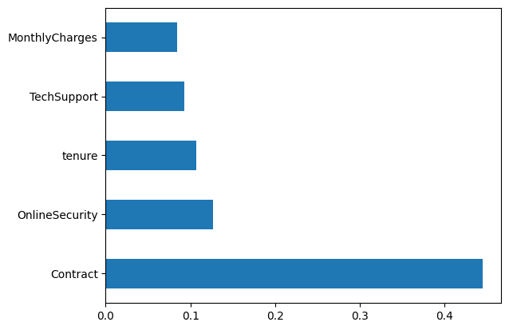
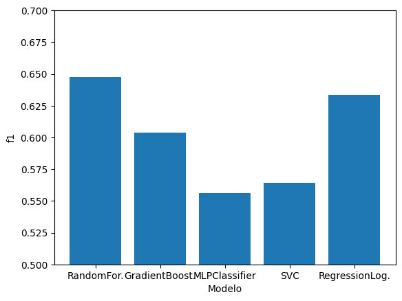
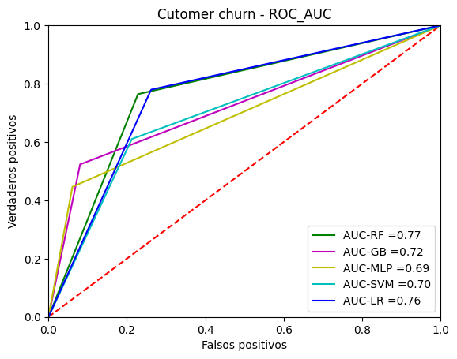

#### Contents

1. [Introducción](#Introducción)
2. [Solución](#Solución)
3. [Preparación y depuración de los datos](#Preparación-y-depuración-de-los-datos)
4. [Datos de entrenamiento y pruebas](#Datos-de-entrenamiento-y-pruebas)
5. [Seleccionar modelo y ajustar parámetros](#Seleccionar-modelo-y-ajustar-parámetros)
   1. [RandomForest](#RandomForest)
   2. [Gradiente Boosting](#Gradiente-Boosting)
   3. [MLPClassifier](#MLPClassifier)
   4. [Soporte Vector machine](#Soporte-Vector-Machine)
   5. [Regresión logística](#Regresion-logistica)
6. [Entrenar modelo](#Entrenar-modelo)
7. [Evaluar rendimiento](#Evaluar-rendimiento)
8. [Hacer predicciones](#Hacer-predicciones)
9. [Comparaciones entre modelos](#Comparaciones-entre-modelos)
10. [Conclusiones](#Conclusiones)
11. [Recomendaciones](#Recomendaciones)
12. [Bibliografía](#Bibliografía)

## Introducción

La rotación de clientes, conocida como "Churn", es un fenómeno que ocurre cuando un cliente decide terminar su relación con una empresa. 
Esto puede suceder por una variedad de razones, desde la insatisfacción con un producto o servicio, hasta el atractivo de la competencia. 
En este ejercicio parte del hackathon de NataSquad 2023, nos centraremos en el problema del churn en una empresa anónima, 
cuyo objetivo es predecir el comportamiento de los clientes para retenerlos.

Para una familiarización con el problema leer el documento Customer_Churn.md, en la carpeta actual. también puede ser encontrado el archivo archive.zip con el juego de datos. En él se puede observar el cliente, las variables predictoras y la variable objetivo (Churn). Un poco más de 7000 instancias de clientes.

La selección de variables con ayuda del especialista puede ayudar a depurar la muestra de clientes suministrada,
comenzando por los falsos positivos y próximo a la frontera o al umbral de clasificación según el modelo.

Encontrar las variables más relevantes en la clasificación de los clientes, ayudará objetivamente a la empresa a saber dónde puede invertir su dinero para retener al cliente. 

La solución pasa por tener en cuenta el problema del desbalance de la muestra, predecir si un cliente abandonara la empresa y cuáles son las variables más importantes que influyen en que el cliente tome esa decisión.

## Solución

Dado que el problema se perfila como un problema de clasificación binaria con aprendizaje, ente los algoritmos candidatos
son RandomForest, Gradient Boosting, MLPClassifier, SVC, LogisticRegression. 

Para lo que se crea un cuaderno por cada modelo y uno para la comparación.

Preliminarmente se hicieron algunas corridas con los datos de pruebas proporcionados y se compararon las métricas 
resultados de diferentes algoritmos (RandomForest, GradientBoosting, MLPClassifier, LogisticRegression, SVM). Se realizó una búsqueda en 
Google para la recomendación de algoritmos alternativo al RandomForest y estos fueron los ganadores. El próximo paso sería
actualizarme en algunos y conocer en otros de las ventajas y desventajas.

El proyecto se desarrolla con Python como lenguaje de programación y las bibliotecas sklearn de scikit-learn. Principalmente con el 
algoritmo RandomForest y la clase GridSearchCV que es una técnica de ajuste de hiperplanos para econtrar la combinación óptima de los parámetros del algoritmo y evitar el OverFitting o sobre ajuste utilizando la validación cruzada.

## Preparación y depuración de los datos
Entre las variables predictoras hay variables de tipo booleano, categóricas, enteras y continúas. Menos de 20 variables.

La variable objetivo (churn) tiene dos valores válidos: No, Yes. Nos interesa predecir a los clientes con valor 'Yes', que abandonarán la empresa.
De la observación de los datos proporcionados se observa una muestra sesgada o con desbalance a favor de la clase negativa 'No', con más del 75%. 

Esto puede dificultar el aprendizaje del modelo al contar con pocos clientes con valor 'Yes' en la variable objetivo, en comparación 
con el valor 'No' que es la clase mayoritaria

Al cargarse los datos se encuentran valores omitidos en la penúltima columna "TotalCharge". 

* Cargos totales vacíos, los pongo a 0.0, los visualice y coincide con que:
	* a) La variable tenure es "0”, el número de meses(tenure) que el cliente ha estado en la empresa es cero.
	* b) La variable Churn tienen valor "No", Por lo que se deduce que no ha tenido tiempo de cobrar la mensualidad o no han podido pagar aún.
	* c) Dado que la muestra esta sesgada a la clase 'No', pudiera simplemente no incluirla en el entrenamiento e incluirla en la submuestra de prueba. Pero asocie a estos clientes como clientes recién incorporados al sistema.
    
Se observan muchas variables categóricas, con las que los modelos no pueden trabajar. Se transforman en valores numéricas.

Retomando el problema del desbalance de la muestra se valora entre las técnicas propuestas el remuestreo y ajuste de los parámetros del algoritmo dando más peso a la clase minoritaria ('Yes').

Se hace un análisis estadístico muy superficial: cantidad, media, desviación estándar, mínimo, máximo, percentiles...
que pendiente refinar un cuaderno con un análisis más profundo donde se utilizan otros estadígrafos como la correlación, tablas de contingencia, chi cuadrado., etc. y subirlo al repositorio.

## Datos de entrenamiento y pruebas
Los datos se separan los primeros 90% para entrenamiento y el ultimo 10% para prueba y validacion. Ahora el 90% de entrenamiento se le dio a 
GridSearchCV, utilizando validación cruzada con 5, 7 y 9 particiones sobre el que se ajustaron los parámetros del modelo. El otro 10% se deja
para prueba y validacion.

## Seleccionar modelo y ajustar parámetros
Se crea un cuaderno por cada modelo donde se van a optimizar sus parámetros. Utilizando GridSearchCV. Para luego comparar sus resultados.

### RandomForest
Cuaderno ns-3.1.1-modelo-RandomForest.ipynb

Basicamente se construye un conjunto aleatorio de arboles, se ejecutan en paralelo y se escoge la clase mas botada. 

Entre sus ventajas esta la fortaleza ante el sobreajuste a los datos de entrenamiento en comparacion con los arboles de decision individuales.
Sencilles en la configuracion de sus paramentros y un buen rendimiento con sus valores por defecto. 
Funciona muy bien para problemas con alto numero de variables de entrada y y gran cantidad de datos de aprendisaje.
Permite realizar una seleccion de variables de alta calidad.

Entre sus desventajas se encuentra la lentitud del aprendisaje si se utilizan muchos arboles y mucha profundida.
El modelo global no resulta interpretable por el usuario.

### Gradiente Boosting
cuaderno ns-3.1.2-modelo-GradientBoosting.ipynb

### MLPClassifier
Cuaderno ns-3.1.3-modelo-MLPClassifier.ipynb

### Soporte Vector Machine
Cuaderno ns-3.1.4-modelo-SVC.ipynb
 
Tiene como objetivo encontrar un hiperplano que separa las instancias de dos clases. Algo parecido a los metodos de regresion logistica. 
La diferencia con otros metodos de separacion lineal es que entre todos los posibles hiperplanos que dividen las instancias en dos clases 
se escoge el que tiene un margen maximo.

Tiene como ventaja que alcanza grandes resultados predictivos en problemas complejos, asignando las variables en un espacio de variables 
mas complejo, aplicando transformaciones no lineales y utilizando el clasificador svm lineal sobre estas nuevas variables.
Muestran buen comportamiento con alto numero de variables e incluso cuando el numero de variable es mayor que e numero de instancias

Como desventaja tenemos la complejidad para a la configuracion. Soluciones muy dependiente de los valores escogidos para el coste
o cuan permisivo es para los errores de entrenamiento y la funcion kernel utilizada para transformar los datos del problema.
Funciona solamente con variables numericas y problemas  de clasificacion binaria

### Regresión logística
Cuaderno ns-3.1.5-modelo-LogisticRegression.ipynb

## Entrenar modelo
En el cuaderno ns-4-comparacion.ipynb se entrenan los modelos con los parámetros encontrado en los ajustes de cada cuaderno asociado a los modelos.

## Evaluar rendimiento
En cada cuaderno asociado a los modelos se imprimen reportes de clasificación con accuracy, precisión, recall, f1;
matriz de confusión, roc-auc curvas. La optimización de los parámetros de los modelos se basó en la métrica f1 debido, como ya
se mencionó anteriormente, al desbalance de la muestra a favor de la clase 'No', favoreciendo f1 a las clases positivas, 
minoritaria en nuestro caso.

En el cuaderno ns-4-comparacion.ipynb se muestra un gráfico de líneas, asociado a la métrica ROC-AUC, donde se comparan los cinco
modelos. Se puede ver que el clasificador MLP es el que mejor minimiza la detección de falsos positivos, pero no es tan bueno para los positivos

## Hacer predicciones
En cada cuaderno asociado a los modelos se muestran gráficas de las predicciones. En el cuaderno ns-4-comparacion.ipynb 

|   Algoritmo       |  Clase | Accuracy  | Precisión | Recall | f1-score |  support |
| ----------------- | ------ | --------- | --------- | ------ | -------- | -------- |
| LogisticRegresion |   0    |    0.7169 |    0.9280 | 0.6594 |   0.7710 |      508 |
|	            |   1    |      ---  |    0.8667 | 0.8667 |   0.6294 |      195 |
| RandomForest      |   0    |    0.7710 |    0.8970 | 0.7717 |   0.8296 |      508 |
|                   |   1    |      ---  |    0.5639 | 0.7692 |   0.6508 |      195 |

se muestran las variables más relevantes encontradas por RandomForest.

|  No. |      Variable       |  Importancia |
| ---- | ------------------  | ------------ |
|  14  |  Contract           |     0.445149 |
|   8  |  OnlineSecurity     |     0.125381 |
|   4  |  tenure             |     0.107268 |
|  11  |  TechSuppor         |     0.092321 |
|  17  |  MontlyCharges      |     0.084935 |
|  18  |  TotalCharges       |     0.057305 |
|   7  |  InternetService    |     0.036901 |
|  13  |  StreamingMovies    |     0.009745 |
|   9  |  OnlineBackUp       |     0.009665 |
|  16  |  PaymentMethod      |     0.008489 |
|  12  |  StreamingTV        |     0.005629 |
|  15  |  PaperlessBilling   |     0.004720 |
|  10  |  DeviceProtection   |     0.002775 |
|   5  |  PhoneServie        |     0.002462 |
|   1  |  SeniorCitizen      |     0.002301 |
|   6  |  MultipleLines      |     0.002114 |
|   3  |  Dependents         |     0.001036 |
|   0  |  gender             |     0.001007 |
|   2  |  Partner            |     0.000798 |

## Comparaciones entre modelos
En el cuaderno ns-4-comparacion.ipynb se ejecutan los 5 algoritmos vistos anteriormente con los parámetros ya ajustados. 
Se calculan, comparan y grafican las métricas f1 y roc-auc. El modelo de RandomForest muestra un mejor resultado para la clasificación, 
a partir de la comparación de la siguiente tabla:

|       Modelo    |    f1    |  roc_auc |
| --------------- | -------- | -------- |
| RandomForest    | 0.647826 | 0.767878 |
| GradientBoost   | 0.603550 | 0.721184 |
| MLPClassifier   | 0.555911 | 0.692565 |
| SVC             | 0.563981 | 0.698829 |
| RegressionLog   | 0.629423 | 0.763058 |

En el cuaderno también se muestran gráficos de barra para comparar ambas métricas por separado. Y se plotea un gráfico de 
línea la curva roc-auc para cada algoritmo.

## Conclusiones
1- Se trabajo con una muestra desbalanceada a favor de los casos negativos. Muestra que no se pudo Re muestrear. Por ello
la comparación se apoyó más en la métrica f1 y roc-auc.

2- Se les dio mayor peso a las instancias de la clase positiva, clase minoritaria, en los modelos que lo permitieron, 
RandomForest y LogisticRegression. Modelos con mejores resultados.

3- Se trabajo implícitamente con Validación cruzada en el ajuste de los parámetros de los modelos. 

4- Personalmente no estoy satisfecho con la capacidad de discriminación del modelo LogisticRegression, pero teniendo 
en cuenta la muestra y las condiciones de la misma es un buen punto de partida para enfrentar el problema propuesto.

5- Entre las variables más relevantes que ayudan a clasificar a un cliente están el tipo de contrato, el pago mensual,
el tiempo en la empresa y la seguridad online.

## Recomendaciones

1- Depurar un poco más el conjunto de datos con que se entrenaron los modelos. Identificar los falsos positivos que están más próximo del umbral de clasificación, de ser posible realizar encuestas de satisfacción a estos clientes.

2- Profundizar en la teoría, ventajas y desventajas de los modelos utilizados, así como su adaptación al problema planteado.

3- Profundizar en los parámetros técnicos, de sklearn, en los diferentes modelos utilizados, con vista a reajustar óptimamente 
los modelos a través de GridSearchCV.

4- Revisar los modelos que no admitieron ajustar el peso a la clase minoritaria para ver si tienen algún parámetro o 
coeficiente parecido.

5- Valorar probar con otros algoritmos para ver cuanto mejora o empeora.

6- Comparar los modelos a partir del modelo entrenado por GridSearchCV que lo hizo con validación cruzada. 
Comparar los resultados con los del cuaderno ns-4-comparacion.ipynb

## Bibliografía

* https://scikit-learn.org/

* https://github.com/shahumar/Free-Machine-Learning-Books/blob/master/book/scikit-learn%20Cookbook%20-%20Second%20Edition.pdf

* http://powerunit-ju.com/wp-content/uploads/2021/04/Aurelien-Geron-Hands-On-Machine-Learning-with-Scikit-Learn-Keras-and-Tensorflow_-Concepts-Tools-and-Techniques-to-Build-Intelligent-Systems-OReilly-Media-2019.pdf

* https://datascience.stackexchange.com/questions/33286/how-to-print-a-confusion-matrix-from-random-forests-in-python
